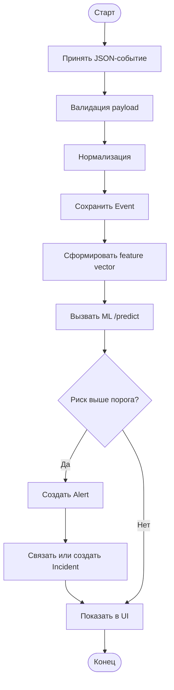

# Activity Diagram

```mermaid
flowchart TD
  A([Старт]) --> B[Принять JSON-событие]
  B --> C[Валидация payload]
  C --> D[Нормализация]
  D --> E[Сохранить Event]
  E --> F[Сформировать feature vector]
  F --> G[Вызвать ML /predict]
  G --> H{Риск выше порога?}
  H -- Да --> I[Создать Alert]
  I --> J[Связать или создать Incident]
  J --> K[Показать в UI]
  H -- Нет --> K
  K --> L([Конец])
```
