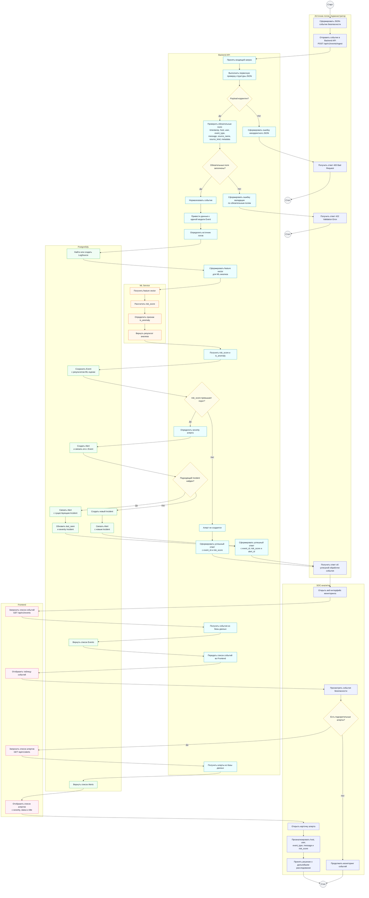

# Диаграмма деятельности: обработка события безопасности в Cyber Early Detection

```mermaid
flowchart TD
    Start((Старт))

    subgraph SRC["Источник логов / Администратор"]
        SRC1["Сформировать JSON-событие безопасности"]
        SRC2["Отправить событие в Backend API<br/>POST /api/v1/events/ingest"]
        SRC_OK["Получить ответ об успешной обработке события"]
        SRC_422["Получить ответ 422 Validation Error"]
        SRC_400["Получить ответ 400 Bad Request"]
    end

    subgraph API["Backend API"]
        API1["Принять входящий запрос"]
        API2["Выполнить первичную проверку структуры JSON"]
        D1{"Payload корректен?"}
        API3["Проверить обязательные поля:<br/>timestamp, host, user, event_type,<br/>message, source_name, source_kind, metadata"]
        D2{"Обязательные поля заполнены?"}
        API4["Нормализовать событие"]
        API5["Привести данные к единой модели Event"]
        API6["Определить источник логов"]
        API7["Сформировать feature vector<br/>для ML-анализа"]
        API8["Получить risk_score и is_anomaly"]
        D3{"risk_score превышает порог?"}
        API9["Определить severity алерта"]
        D4{"Подходящий Incident найден?"}
        API10["Сформировать успешный ответ<br/>с event_id, risk_score и alert_id"]
        API11["Алерт не создается"]
        API12["Сформировать успешный ответ<br/>с event_id и risk_score"]
        API_ERR1["Сформировать ошибку валидации<br/>по обязательным полям"]
        API_ERR2["Сформировать ошибку некорректного JSON"]
        API13["Получить события из базы данных"]
        API14["Передать список событий во Frontend"]
        API15["Получить алерты из базы данных"]
    end

    subgraph DB["PostgreSQL"]
        DB1["Найти или создать LogSource"]
        DB2["Сохранить Event<br/>с результатом ML-оценки"]
        DB3["Создать Alert<br/>и связать его с Event"]
        DB4["Связать Alert<br/>с существующим Incident"]
        DB5["Обновить last_seen<br/>и severity Incident"]
        DB6["Создать новый Incident"]
        DB7["Связать Alert<br/>с новым Incident"]
        DB8["Вернуть список Events"]
        DB9["Вернуть список Alerts"]
    end

    subgraph ML["ML Service"]
        ML1["Получить feature vector"]
        ML2["Рассчитать risk_score"]
        ML3["Определить признак is_anomaly"]
        ML4["Вернуть результат анализа"]
    end

    subgraph SOC["SOC-аналитик"]
        SOC1["Открыть веб-интерфейс мониторинга"]
        SOC2["Просмотреть события безопасности"]
        D5{"Есть подозрительные алерты?"}
        SOC3["Открыть карточку алерта"]
        SOC4["Проанализировать host, user,<br/>event_type, message и risk_score"]
        SOC5["Принять решение о дальнейшем расследовании"]
        SOC6["Продолжить мониторинг событий"]
    end

    subgraph FE["Frontend"]
        FE1["Запросить список событий<br/>GET /api/v1/events"]
        FE2["Отобразить таблицу событий"]
        FE3["Запросить список алертов<br/>GET /api/v1/alerts"]
        FE4["Отобразить список алертов<br/>с severity, status и title"]
    end

    End1((Стоп))
    End2((Стоп))
    End3((Стоп))

    Start --> SRC1 --> SRC2 --> API1 --> API2 --> D1

    D1 -- "Да" --> API3 --> D2
    D1 -- "Нет" --> API_ERR2 --> SRC_400 --> End1

    D2 -- "Нет" --> API_ERR1 --> SRC_422 --> End2
    D2 -- "Да" --> API4 --> API5 --> API6 --> DB1 --> API7

    API7 --> ML1 --> ML2 --> ML3 --> ML4 --> API8
    API8 --> DB2 --> D3

    D3 -- "Да" --> API9 --> DB3 --> D4
    D3 -- "Нет" --> API11 --> API12 --> SRC_OK

    D4 -- "Да" --> DB4 --> DB5 --> API10
    D4 -- "Нет" --> DB6 --> DB7 --> API10

    API10 --> SRC_OK
    SRC_OK --> SOC1

    SOC1 --> FE1 --> API13 --> DB8 --> API14 --> FE2 --> SOC2 --> D5

    D5 -- "Да" --> FE3 --> API15 --> DB9 --> FE4 --> SOC3 --> SOC4 --> SOC5 --> End3
    D5 -- "Нет" --> SOC6 --> End3

    classDef actor fill:#eef2ff,stroke:#4f46e5,stroke-width:1px,color:#111827;
    classDef backend fill:#ecfeff,stroke:#0891b2,stroke-width:1px,color:#111827;
    classDef db fill:#f0fdf4,stroke:#16a34a,stroke-width:1px,color:#111827;
    classDef ml fill:#fff7ed,stroke:#ea580c,stroke-width:1px,color:#111827;
    classDef frontend fill:#fdf2f8,stroke:#db2777,stroke-width:1px,color:#111827;
    classDef decision fill:#fefce8,stroke:#ca8a04,stroke-width:1px,color:#111827;
    classDef terminal fill:#f3f4f6,stroke:#374151,stroke-width:1px,color:#111827;

    class SRC1,SRC2,SRC_OK,SRC_422,SRC_400,SOC1,SOC2,SOC3,SOC4,SOC5,SOC6 actor;
    class API1,API2,API3,API4,API5,API6,API7,API8,API9,API10,API11,API12,API_ERR1,API_ERR2,API13,API14,API15 backend;
    class DB1,DB2,DB3,DB4,DB5,DB6,DB7,DB8,DB9 db;
    class ML1,ML2,ML3,ML4 ml;
    class FE1,FE2,FE3,FE4 frontend;
    class D1,D2,D3,D4,D5 decision;
    class Start,End1,End2,End3 terminal;
```
