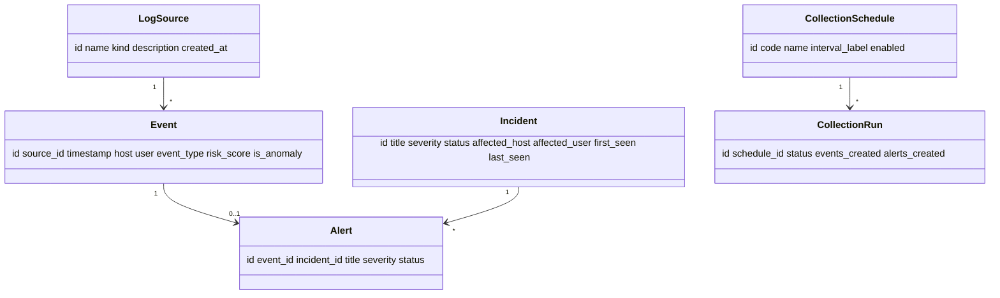

# Class Diagram

```mermaid
classDiagram
  class LogSource { id name kind description created_at }
  class Event { id source_id timestamp host user event_type risk_score is_anomaly }
  class Alert { id event_id incident_id title severity status }
  class Incident { id title severity status affected_host affected_user first_seen last_seen }
  class CollectionSchedule { id code name interval_label enabled }
  class CollectionRun { id schedule_id status events_created alerts_created }
  LogSource "1" --> "*" Event
  Event "1" --> "0..1" Alert
  Incident "1" --> "*" Alert
  CollectionSchedule "1" --> "*" CollectionRun
```
