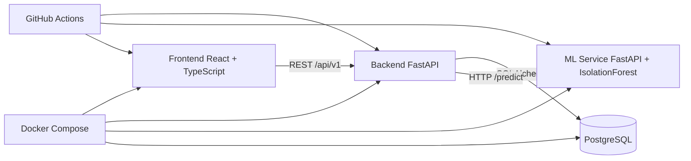

# Component Diagram

```mermaid
flowchart LR
  FE[Frontend React + TypeScript] -->|REST /api/v1| BE[Backend FastAPI]
  BE -->|SQLAlchemy| DB[(PostgreSQL)]
  BE -->|HTTP /predict| ML[ML Service FastAPI + IsolationForest]
  GHA[GitHub Actions] --> BE
  GHA --> ML
  GHA --> FE
  DC[Docker Compose] --> FE
  DC --> BE
  DC --> ML
  DC --> DB
```
