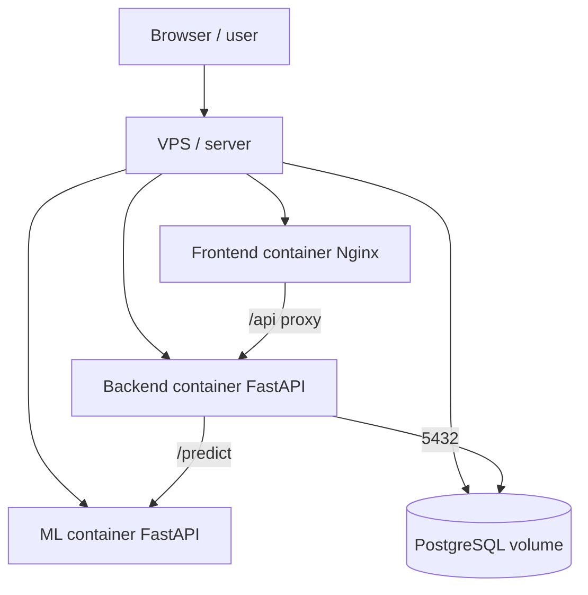

# Deployment Diagram

```mermaid
flowchart TB
  U[Browser / user] --> S[VPS / server]
  S --> FE[Frontend container Nginx]
  S --> BE[Backend container FastAPI]
  S --> ML[ML container FastAPI]
  S --> DB[(PostgreSQL volume)]
  FE -->|/api proxy| BE
  BE -->|/predict| ML
  BE -->|5432| DB
```
