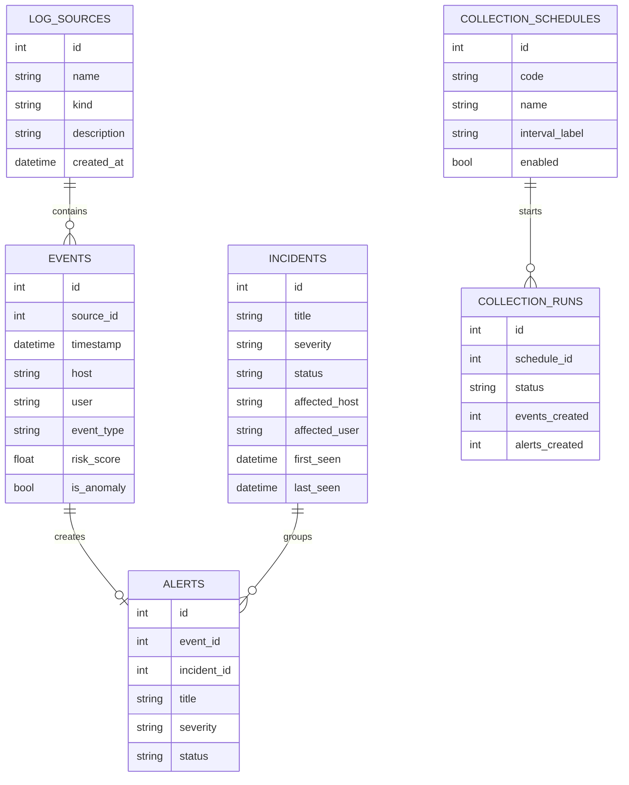

# ER Diagram

```mermaid
erDiagram
  LOG_SOURCES ||--o{ EVENTS : contains
  EVENTS ||--o| ALERTS : creates
  INCIDENTS ||--o{ ALERTS : groups
  COLLECTION_SCHEDULES ||--o{ COLLECTION_RUNS : starts
  LOG_SOURCES { int id string name string kind string description datetime created_at }
  EVENTS { int id int source_id datetime timestamp string host string user string event_type float risk_score bool is_anomaly }
  ALERTS { int id int event_id int incident_id string title string severity string status }
  INCIDENTS { int id string title string severity string status string affected_host string affected_user datetime first_seen datetime last_seen }
  COLLECTION_SCHEDULES { int id string code string name string interval_label bool enabled }
  COLLECTION_RUNS { int id int schedule_id string status int events_created int alerts_created }
```
