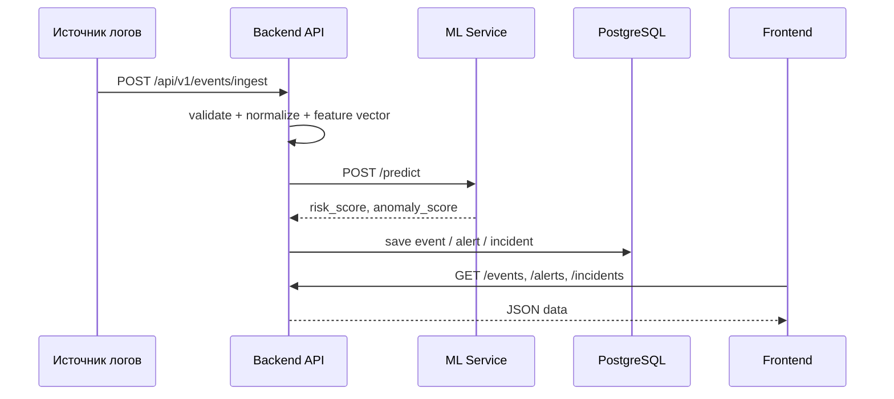

# Sequence Diagram

```mermaid
sequenceDiagram
  participant S as Источник логов
  participant B as Backend API
  participant M as ML Service
  participant D as PostgreSQL
  participant F as Frontend
  S->>B: POST /api/v1/events/ingest
  B->>B: validate + normalize + feature vector
  B->>M: POST /predict
  M-->>B: risk_score, anomaly_score
  B->>D: save event / alert / incident
  F->>B: GET /events, /alerts, /incidents
  B-->>F: JSON data
```
