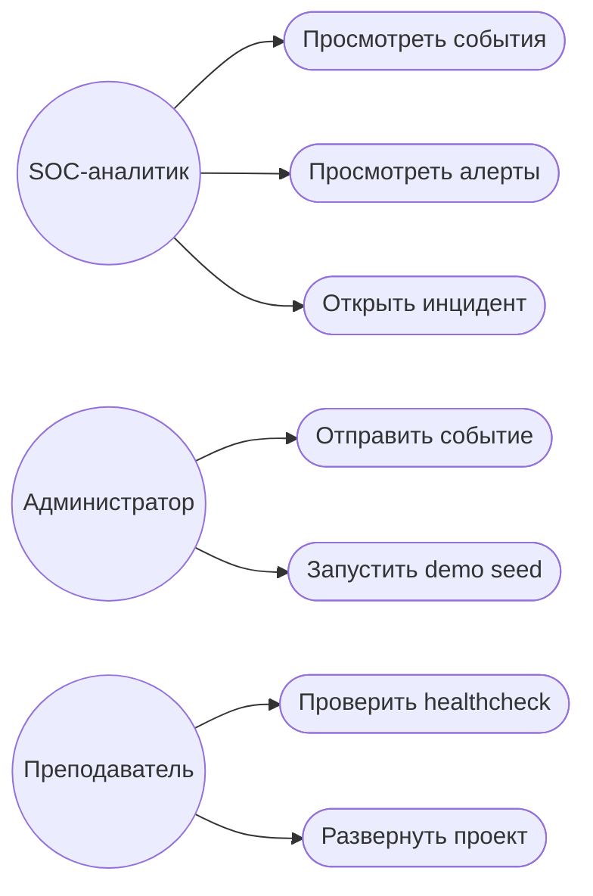

# Use Case Diagram

```mermaid
flowchart LR
  SOC((SOC-аналитик)) --> UC2([Просмотреть события])
  SOC --> UC3([Просмотреть алерты])
  SOC --> UC4([Открыть инцидент])
  Admin((Администратор)) --> UC1([Отправить событие])
  Admin --> UC5([Запустить demo seed])
  Checker((Преподаватель)) --> UC6([Проверить healthcheck])
  Checker --> UC7([Развернуть проект])
```
